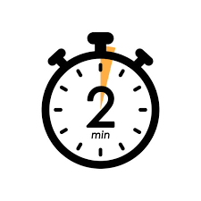

# stopwatch 

Welcome to the Stopwatch Application! This project is a simple yet functional stopwatch built using HTML, CSS, and JavaScript. It provides users with an intuitive interface to track time with precision, making it ideal for various activities such as workouts, cooking, studying, or any task that requires time management.

click [demo](https://www.example.com) to see project

## Technologies Used

#### HTML:
 For structuring the stopwatch interface.

#### CSS:
 For styling the application and creating a visually appealing layout.

#### JavaScript:
 For implementing the stopwatch functionality, including time calculations and event handling.